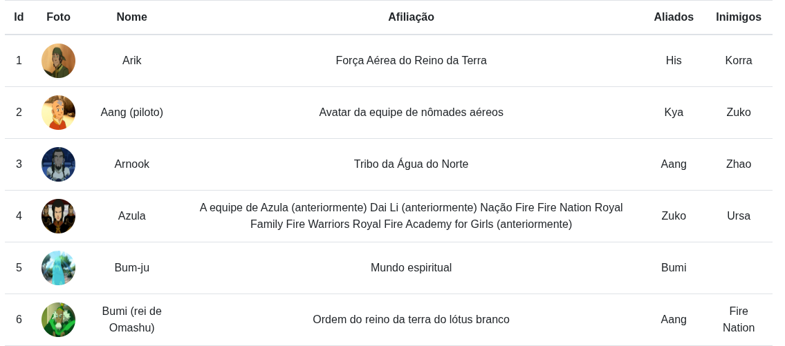

# 🌊 Avatar: The Last Airbender - Django Web App

Este é um projeto em Django que consome a [API pública do universo Avatar: The Last Airbender](https://last-airbender-api.fly.dev/), traduz automaticamente os dados do inglês para o português usando a biblioteca `googletrans`, e exibe as informações em uma tabela interativa com paginação.

Foi um projeto desafiador e enriquecedor, unindo várias tecnologias e conceitos como consumo de APIs REST, tradução assíncrona com `asyncio`, paginação de dados, e exibição elegante via templates HTML do Django.

---

## 🌐 Acesso Online

🔗 Acesse a aplicação no ar: [Avatar: The Last Airbender](https://airbender-web.vercel.app)

---

## 🔍 Funcionalidades

- ✅ Consome dados da API do Avatar: The Last Airbender
- 🌐 Traduz os campos automaticamente do inglês para o português
- 📋 Exibe as informações em uma tabela: Id, Nome, Afiliação, Aliados e Inimigos
- 🔄 Paginação de resultados (próxima / anterior)
- ⚡ Uso de `asyncio` para otimizar as traduções simultâneas
- 🌍 Interface amigável e responsiva com Django Templates

---

## 📸 Demonstração



---

## 🛠️ Tecnologias Utilizadas

- **Python 3.13.7**
- **Django 5.2.7**
- **Requests** - para consumir a API REST
- **Googletrans** (`googletrans==4.0.2`) - para traduzir textos automaticamente
- **Asyncio** - para executar traduções em paralelo e melhorar performance
- **HTML5 + Django Templates** - para renderizar a interface web

---

## 📋 Pré-requisitos

Para rodar este projeto, você precisa ter **uma** das seguintes opções configuradas em sua máquina:

### Opção 1: Executar com Python

- [Python 3.13.7+](https://www.python.org/downloads/) instalado

### Opção 2: Executar com Docker

- [Docker Engine](https://docs.docker.com/get-docker/) instalado

---

## 🚀 Como rodar o projeto

Você pode executar este projeto de duas formas: diretamente com Python ou utilizando Docker.

### ✅ Rodando com Python

1. Clone este repositório:
    ```bash
    git clone https://github.com/devisonsantana/avatar-airbender-web-django.git
    ```
2. Crie e ative um ambiente virtual (Opcional):
    ```bash
    # Cria um ambiente virtual para instalar os módulos necessarios
    python3 -m venv .venv
    
    # Ativa o ambiente virtual
    source ./.venv/bin/activate
    ```
3. Instale as dependências:
    ```bash
    # Instala todas as dependencias
    pip install -r requirements.txt
    ```
4. Execute o projeto:
   ```bash
   # Acesse seu localhost:8000
   python3 manage.py runserver
   ```
#### Desativando ambiente virtual
   
Caso não deseje usar mais o ambiente virtual você pode desativa-lo passando esse commando:
```bash
deactivate
```

### 🐳 Rodando com Docker

1. Clone este repositório:
    ```bash
    git clone https://github.com/devisonsantana/avatar-airbender-web-django.git && cd avatar-airbender-web-django/
    ```
2. Construa a imagem Docker:
    ```bash
    docker build -t app ./
    ```
3. Execute o container:
    ```bash
    docker run --rm -p 8000:8000 app
    ```

## 🗂️ Estrutura do Projeto

```bash
./
├── assets/
│   └── screenshot.png
├── avatar/
│   ├── admin.py
│   ├── apps.py
│   ├── __init__.py
│   ├── migrations/
│   │   ├── __init__.py
│   ├── models.py
│   ├── templates/
│   │   └── index.html
│   ├── tests.py
│   ├── urls.py
│   └── views.py
├── dockerfile
├── manage.py
├── readme.md
├── requirements.txt
├── setup/
│   ├── asgi.py
│   ├── __init__.py
│   ├── settings.py
│   ├── urls.py
│   └── wsgi.py
└── vercel.json
```

--- 

<div align="center">
    <p style="font-weight: bold">Obrigado por visitar</p>
    
</div>